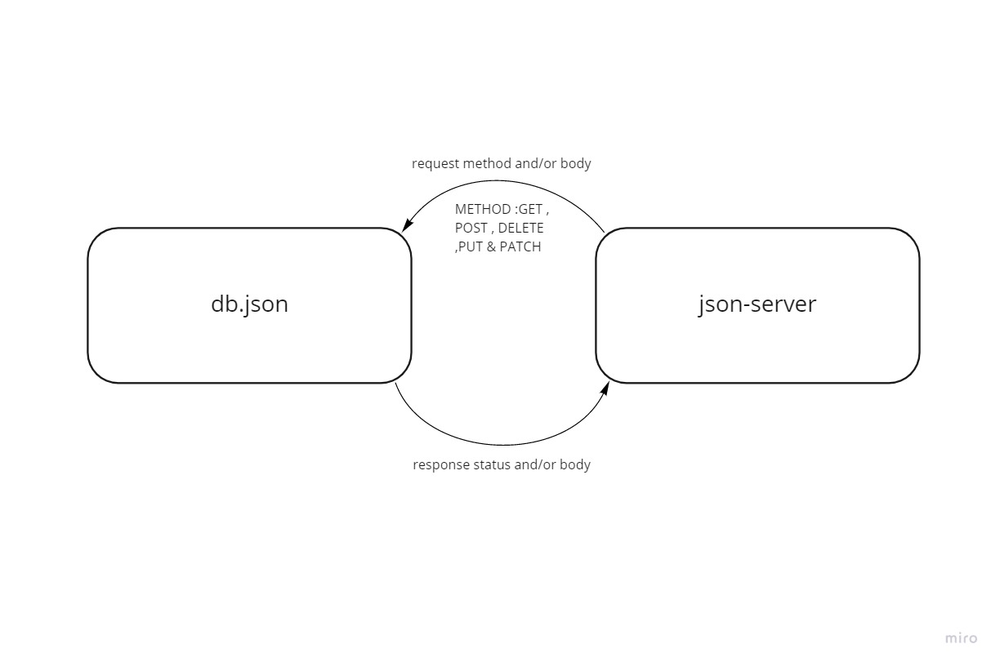

# api-server

### Author: Abdallah Zakaria
## Documentation
[swaggerhub](https://app.swaggerhub.com/apis/Abdallah-Zakaria/401-d5-test/0.1)

## Setup 
**initialize the server**
- `npm i -g json-server`
**start the server**
- `json-server id=_id --watch data/db.json --routes data/routes.json`

## Test
- GET ALL: GET - http://localhost:3000/categories
- GET SOME: GET - http://localhost:3000/categories?category=electronics
- GET ONE: GET - http://localhost:3000/categories/1
- UPDATE ONE: PATCH or PUT - http://localhost:3000/categories/1
- DELETE ONE: DELETE - http://localhost:3000/categories/1

## UML

