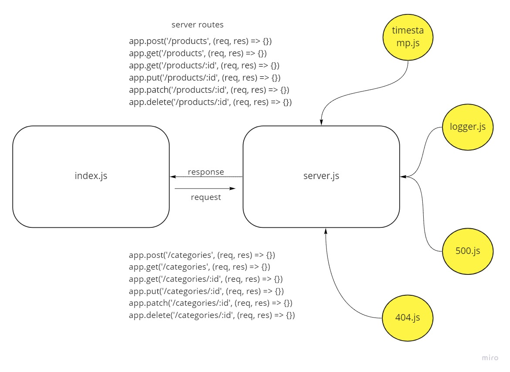

# api-server

### Author: Abdallah Zakaria
## Documentation
[swaggerhub](https://app.swaggerhub.com/apis/Abdallah-Zakaria/401-d5-test/0.1)

## Setup 
  - `npm init -y`
  - `npm i express dotenv `
  - pass your port number
  - start the server `node index.js`
## Test
- manual test
  - GET ALL: GET - http://localhost:3000/categories
  - GET ONE: GET - http://localhost:3000/categories/1
  - UPDATE ONE: PATCH or PUT - http://localhost:3000/categories/1
  - DELETE ONE: DELETE - http://localhost:3000/categories/1
- jest test
  - `npm i -D jest supertest`
  - `npm test <'file name'>`

## UML

